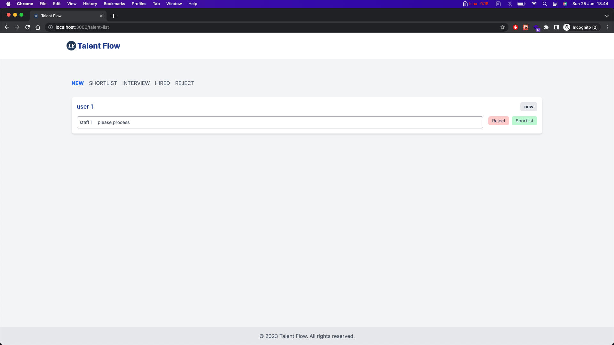

# TALENT FLOW

<p align="center">
   <p>
      Landing Page
   </p>
   
   
</p>

<br /> 

<p align="center">
   <p>
      Talent List Page
   </p>
   
   
</p>

<br /> 

## Libraries
These are the main library for creating the UI
| Library                 | Description                              |
|-------------------------|------------------------------------------|
| next 13                 | React web application framework          |
| react                   | For creating UI components               |
| tailwind                | CSS framework                            |
| react testing library   | unit test for react components           |

## Deploy on Vercel

This project deploy on Vercel and you can access it through this https://talent-flow.vercel.app/

## Coverage Report

Create Unit Test and Integration Test using React Testing Library/JEST under `__tests__` folders


## Available Scripts

```bash
yarn dev
yarn lint
yarn test
yarn test:coverage
```

Open [http://localhost:3000](http://localhost:3000) with your browser to see the result.

This project uses [`next/font`](https://nextjs.org/docs/basic-features/font-optimization) to automatically optimize and load Inter, a custom Google Font.


## Learn More

To learn more about Next.js, take a look at the following resources:

- [Next.js Documentation](https://nextjs.org/docs) - learn about Next.js features and API.
- [Learn Next.js](https://nextjs.org/learn) - an interactive Next.js tutorial.

You can check out [the Next.js GitHub repository](https://github.com/vercel/next.js/) - your feedback and contributions are welcome!
